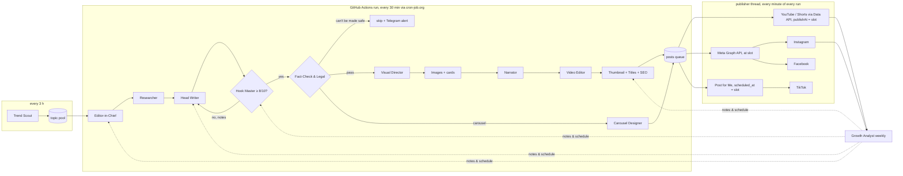

# Architecture

## The agent team

| # | Agent | Prompt | Does | Output |
|---|---|---|---|---|
| 1 | **Trend Scout** | `prompts/trend_scout.md` | Every 3 h: pulls Google Trends PH, 5 news feeds, X/Twitter PH trends, YouTube + Google autocomplete for 13 seed keywords, Reddit (optional), YouTube mostPopular PH (optional), and the civic calendar. Stores every value so the next run can measure **acceleration**, then ranks topics that are about to peak. | `topics` table |
| 2 | **Editor-in-Chief** | `editor_in_chief.md` | When a slot enters the production window (≈8 h ahead), assigns the freshest fitting topic, balancing pillar mix and avoiding repeats. | brief per item |
| 3 | **Researcher** | `researcher.md` | Anthropic web search (≤25 searches), primary sources first. Timeline, facts with `[S#]` citations, people (established vs. alleged), surprising angles, historical roots. | `dossier.md` |
| 4 | **Head Writer** | `scriptwriter.md` | Historically-style script in Taglish: cold-open skit → pop-quiz hook → "Standard Issue #N" → chapters with open loops → system reveal → callback ending. Scene-by-scene with visual cues. | `script_r*.json` |
| 5 | **Hook Master** | `hook_master.md` | Retention psychologist: rewrites first 5 s, re-hooks at 0:30 / 1:30 / 25 / 50 / 75 %, scores hook & retention. Below 8/10 → sent back to the writer (max 3 drafts, then the slot is skipped). | `hook_r*.json` |
| 6 | **Fact-Check & Legal** | `fact_checker.md` | Checks every line against the dossier, enforces cyber-libel rules, applies the naming policy (names only for history or final convictions, otherwise roles) and rewrites; anything it can't make safe is skipped automatically. | `factcheck.json` |
| 7 | **Visual Director** | `visual_director.md` | One visual per scene: AI illustration, motion-graphic card (stat / quote / timeline / document / place), or reuse; camera move. | `shots.json` |
| 8 | **Narrator** | (code: `media/tts.py`) | ElevenLabs per scene with request stitching for natural flow, word timestamps for captions, optional separate character voices for skits. Fish Audio as a cheaper alternative. | `audio/*.mp3` |
| 9 | **Video Editor** | (code: `media/render.py`) | FFmpeg: Ken-Burns shots timed to narration, music bed, loudness-normalised to −14 LUFS, burned word captions + hook text on verticals, SRT, chapters. | `video.mp4` |
| 10 | **Thumbnail Artist** | `thumbnail_artist.md` | 3 ranked concepts (one frozen ironic moment, no text by default), generates the art, composites 1280×720. | `thumbnail.jpg` |
| 11 | **Title Writer** | `title_writer.md` | 10 options scored for curiosity / clarity / keyword / honesty; primary + 2 alternates for later swaps. | `titles.json` |
| 12 | **SEO & Discovery Writer** | `seo_writer.md` | Description written for YouTube search *and* AI answer engines, chapters, sources, tags, and native captions for Shorts / IG / FB / TikTok. | `seo.json` |
| 13 | **Carousel Designer** | `carousel_designer.md` | 6–10 slide scroll-stoppers (cover hook, one idea per slide, "so what", CTA), fact-checked, rendered 1080×1350. | `slides/*.jpg` |
| 14 | **Publisher** | (code: `publish/youtube.py`, `publish/postforme.py`) | YouTube + Shorts upload directly through the TFS Automation Google Cloud project with native `publishAt` scheduling, custom thumbnail and the synthetic-media flag. IG Reels & carousels and FB Reels & multi-photo posts go direct through the Meta app TFS Content Creator at the slot time. TikTok (public, AI-generated label) goes through Post for Me with `scheduled_at` = slot, and each result is confirmed afterwards. | `posts` table |
| 15 | **Growth Analyst** | `analyst.md` | Weekly: YouTube Analytics + IG insights → what worked, standing notes appended to every agent's prompt, schedule retune, title swaps on low-CTR videos. | `analyst_notes/` |
| 16 | **Proofreader** | `audio_qa.md` | Whisper (faster-whisper, `small`) transcribes the finished video. Each scene is word-matched against the script, and a Claude judge decides which differences are real: skipped words, wrong numbers or names, garbled audio. Scenes that fail are re-voiced, with a respelled line if pronunciation was the problem. | `qa_r*.json` |
| 17 | **Visual QA** | `visual_qa.md` | Looks at a frame from every shot (plus the hook frame, thumbnail or carousel slides) next to the cast model sheets. It checks for wrong or deformed characters, real-person likeness, garbled AI text, misspelled or cut-off card text, captions under the platform buttons, anachronisms and appeal. Blocking frames get a corrected prompt and are regenerated and re-rendered, up to 2 rounds; if a problem remains, the piece is skipped. | `qa_r*.json`, `qa_fixes.json` |
| 18 | **Narration Editor** (prevention) | `narration_editor.md` | Before any voice is recorded, makes the script safe to read aloud: numbers, dates, times and law numbers written as spoken; acronyms hyphenated; no emphasis hyphens or capitals; no word split across scenes. Meaning and length never change. | `narration.json` |
| 19 | **Pre-flight Art Director** (prevention) | `preflight_art.md` | Before any image is generated, fixes the shot list: no readable text or exact figures in the art, recurring characters named with their exact outfits and neutral-clothed extras, no real people, no anachronisms, consistent places, 9:16 composition. Checks every card's facts against the script and dossier and its field layout. | `shots.json` (from `shots_draft.json`) |
| 20 | **Sound Designer** | `sound_designer.md` | Scores each video from the sound library: a music mood per stretch of the story (e.g. curious → suspense → hopeful), plus a few accent effects anchored to the exact word they land on (gavel on a ruling, cash register on a peso amount, record scratch on a punchline). Code adds the animation sounds: card whoosh, stat pop and count ticks, map pins, stamp. Music is ducked under the narration. | `sound.json`, `work/mix.wav` |

Every agent's system prompt = `docs/STYLE_BIBLE.md` + its role prompt + the analyst's standing notes
(prompt-cached, so the shared prefix is billed at the cache rate).

## Flow

## Daily output (config/schedule.yaml)

| Produced | Published as |
|---|---|
| 1 long-form (10–16 min, 16:9) — scale later by adding slots | 1 × YouTube long-form (18:00 PHT) |
| 3 verticals (35–58 s, 9:16) | 3 × Shorts, 3 × IG Reels, 3 × FB Reels, 3 × TikTok — same master, staggered times, platform-native captions |
| 2 carousels (1080×1350) | 2 × IG carousel, 2 × FB multi-photo post |

## Reliability

- **Checkpointed**: every step writes its artifact to `TFS_DATA_DIR/items/<id>/`; a crash or approval pause resumes where it stopped.
- **Prevent first, then review**: the Narration Editor and Pre-flight Art Director fix problems before anything is generated. The review team then blocks only safety/legal issues, garbled text, wrong on-screen facts and wrong or deformed characters. A narration flag blocks only when the same scene is flagged again after a re-voice; one-off flags appear as notes in the Telegram "Ready" message, which includes how to pull that post (`hold` workflow with the item id).
- **Skip, don't ship junk**: failing the quality bar, a fact-check reject, or missing the first slot → the slot is skipped and you're notified.
- **Publishing never waits for production**: inside each run, a publisher thread checks every minute. A run
  stays up for any Facebook/Instagram post due within 35 minutes, and runs never overlap (concurrency group).
- **Fully cloud, no server**: cron-job.org triggers the GitHub Actions `run` workflow every 30 min. State (SQLite
  DB, notes, media of unposted items) lives in a private R2 bucket: it's restored at the start of each run and
  saved after every step and every publish, with a dated DB backup daily.
- All times are Asia/Manila.

## Running costs (1 long-form + 3 verticals + 2 carousels a day; Sep 2026 list prices — verify)

| Item | Basis | ≈ / month |
|---|---|---|
| Claude — Max subscription via Claude Code (default) | flat plan, within its 5-hour/weekly usage limits | the Max plan you already pay |
| … or Claude API (`llm.backend: api`) | ~$3.5 per long-form, ~$1.2 per vertical, ~$1 per carousel incl. web search | ~$275 |
| ElevenLabs narration | ~430k characters/month (multilingual v2) → Pro tier (500k) | ~$99 |
| Images (Gemini 2.5 Flash Image, ~$0.04 each) | ~130 images/day | ~$160 |
| Post for Me (TikTok only) | ~90 posts/month | $10 |
| GitHub Actions (public repo) + cron-job.org | standard runners | $0 |
| Cloudflare R2 state | a few GB (media pruned after 10 days) | ~$0 (free tier: 10 GB) |
| **Total** | | **≈ $270 + your Max plan** (≈ $545 with the API instead) |

Each extra daily long-form adds roughly $200/month (Claude ~$105, images ~$100, and ElevenLabs moves up to the Scale tier after the second).
